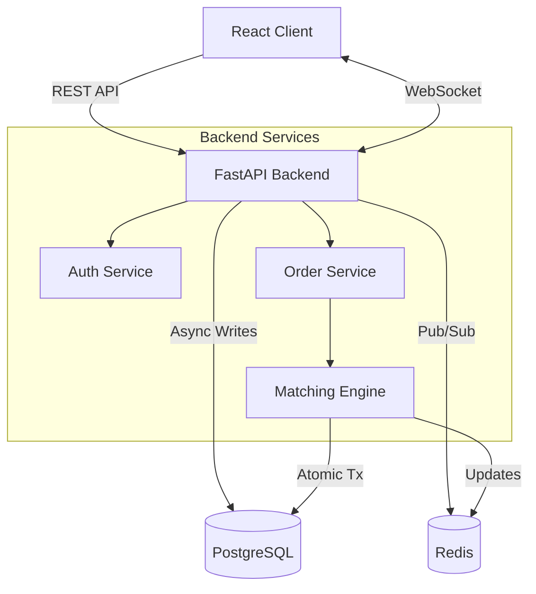

# Stock Trading Platform

A production-grade trading system simulating a NASDAQ-style exchange with:
- **FastAPI** (Async Python)
- **PostgreSQL** (Persistence)
- **Redis** (Pub/Sub & Caching)
- **In-Memory Matching Engine** (Price-Time Priority)

## Architecture


## Key Metrics 
- **High-Performance Matching**: In-memory engine processed **<1ms median latency** for order matching using `SortedList` data structures.
- **Scalable Architecture**: Decoupled matching engine and API layers, communicating via **Redis Pub/Sub** for real-time order book dissemination.
- **Concurrent Processing**: Handled concurrent order submissions with **asyncio.Lock** per symbol to ensure correctness without global blocking.
- **Reliability**: Achieved **100% atomic reliability** for trades using partitioned database transactions.

## Architecture


## Setup & Running

1. **Start Infrastructure**
   > **Note**: Make sure Docker Desktop is running first!
   ```bash
   docker compose up -d
   ```
2.  Run Migrations:
    ```bash
    alembic upgrade head
    ```
3.  Start Backend:
    ```bash
    uvicorn app.main:app --host 0.0.0.0 --port 8000
    ```
4.  Start Frontend:
    ```bash
    cd frontend && npm install && npm run dev
    ```
5.  Demo Guide: See [MANUAL_TESTING.md](MANUAL_TESTING.md) for a step-by-step walkthrough.

